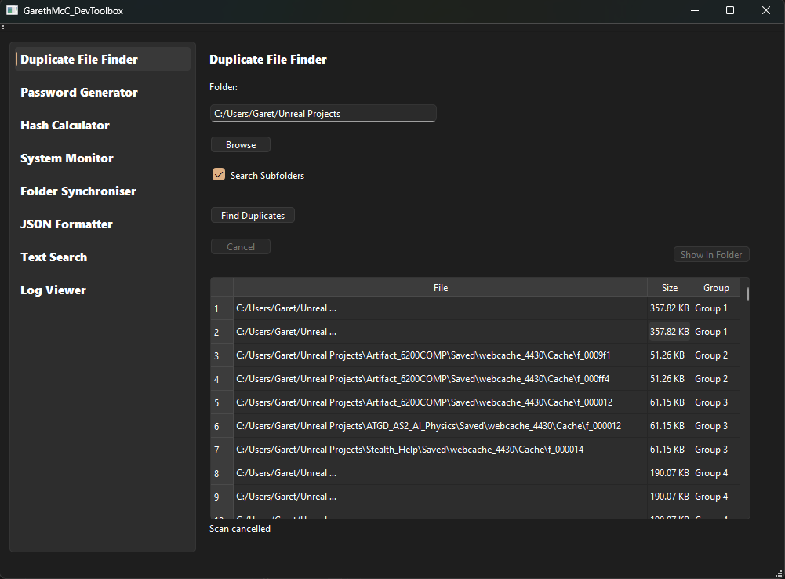
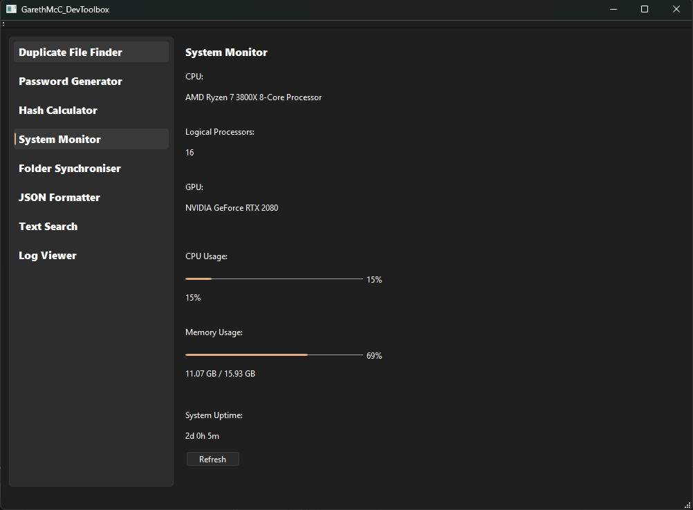
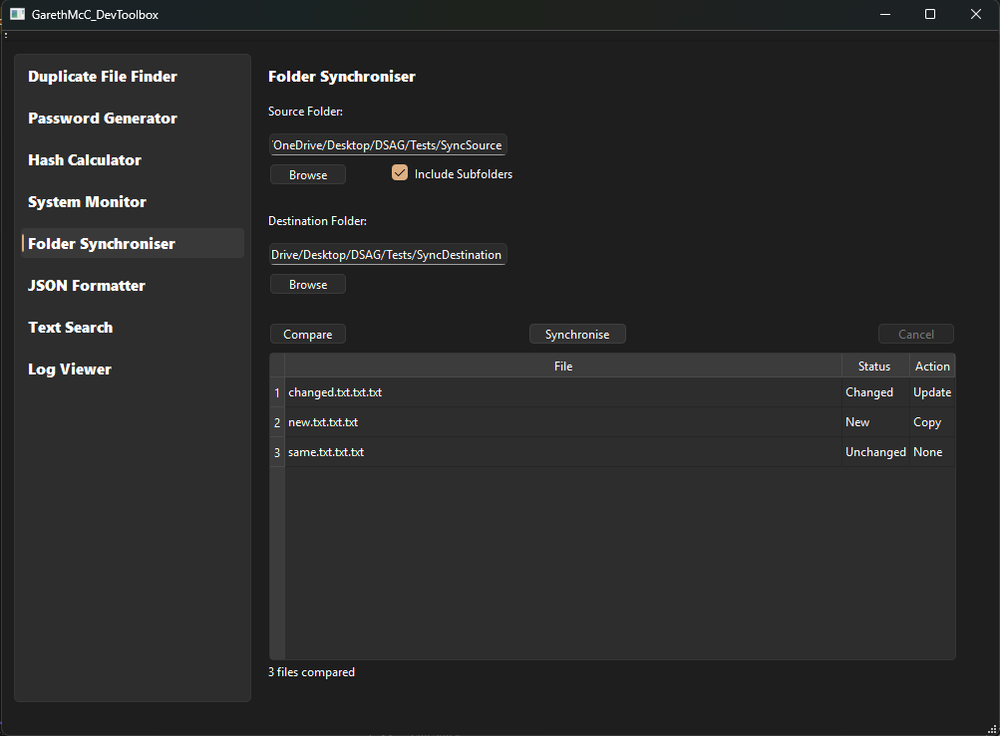
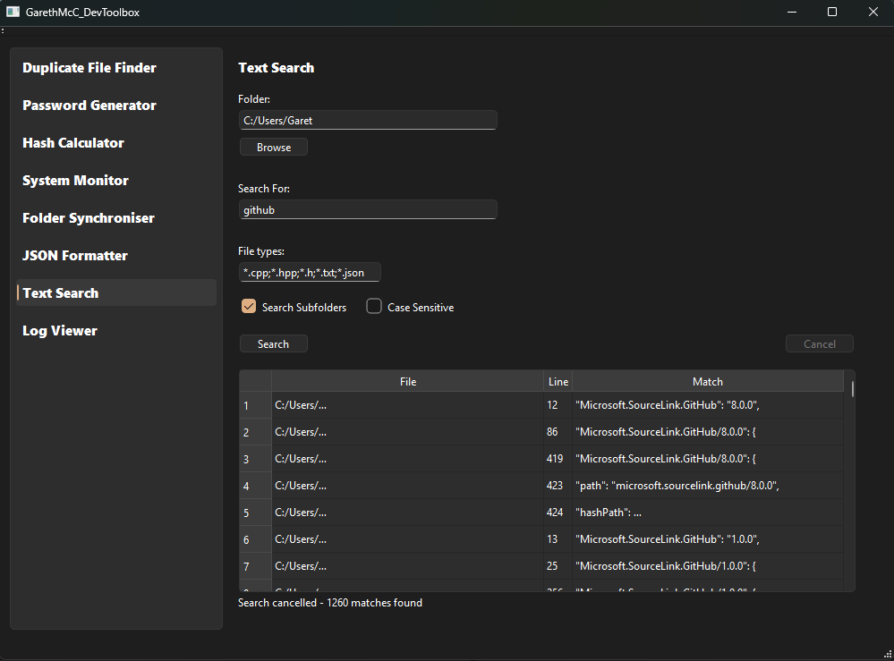
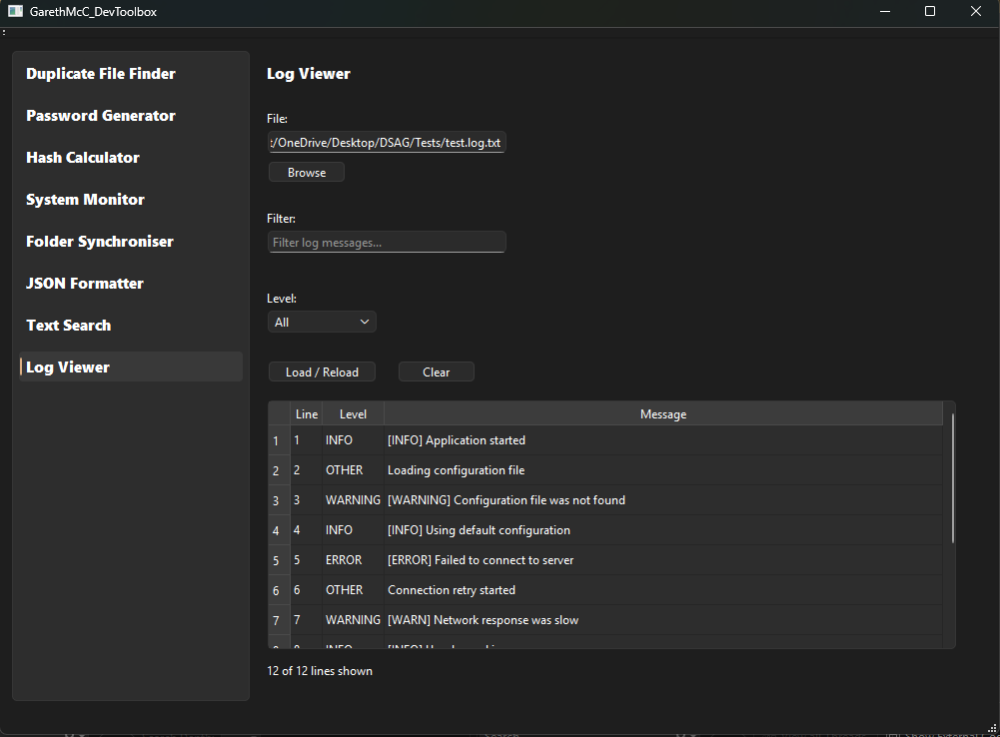

# GarethMcC DevToolbox

A desktop developer utility suite I built with **C++, Qt 6 and CMake**.

The project brings together a collection of practical development and system utilities in a single Qt Widgets application. 
It was developed as a portfolio project to demonstrate modern C++, desktop application development, file system programming, asynchronous processing and Windows system integration

## Features

### Duplicate File Finder
Scans folders for duplicate files and groups matching files together

- Recursive folder scanning
- File-size pre-filtering
- SHA-256 content verification
- Optimised staged hashing for larger scans
- Background processing
- Cancellation support
- Human-readable file sizes
- Open selected results in File Explorer

### Password Generator
Generates configurable random passwords.

- Adjustable password length
- Uppercase and lowercase letters
- Numbers
- Symbols
- Validation when no character types are selected
- Copy generated passwords to the clipboard

### Hash Calculator
Calculates cryptographic hashes for files.

- SHA-256
- SHA-512
- MD5
- File selection
- Copy hash results to the clipboard
- Input and error validation

### System Monitor
Displays live information about the Windows system.

- Live CPU usage
- Live physical memory usage
- System uptime
- CPU model
- Logical processor count
- GPU detection through DXGI
- Automatic one-second refresh
- Manual refresh option

### Folder Synchroniser
Safely compares and synchronises two folders.

- One-way Source → Destination synchronisation
- Recursive subfolder support
- Detects New, Changed and Unchanged files
- Preview changes before synchronisation
- Copy new files
- Update changed files
- SHA-256 comparison for same-sized files
- Confirmation before modifying destination files
- Background processing and cancellation
- Preserves relative folder structure
- Does not automatically delete destination files

### JSON Formatter / Validator
Provides tools for working with JSON data.

- Format / pretty-print JSON
- Minify JSON
- Validate JSON
- Detailed parsing errors
- Clear input and output

### Text Search
Searches for text across files in a folder.

- Recursive searching
- Configurable file extensions
- Case-sensitive or case-insensitive search
- Displays file, line number and matching text
- Background processing
- Cancellation support
- Retains results already found when a search is cancelled

### Log Viewer
Loads and filters text-based log files.

- Detects INFO, WARNING, ERROR and OTHER entries
- Filter by log level
- Live text filtering
- Combined text and level filtering
- Original line-number tracking
- Load / Reload support
- Clear loaded logs

## Screenshots

### Duplicate File Finder


### System Monitor


### Folder Synchroniser


### Text Search


### Log Viewer


## Technical Highlights

The project uses a range of modern C++ and Qt functionality, including:

- **C++23**
- **Qt 6 Widgets**
- **CMake**
- `std::filesystem`
- RAII and smart pointers
- `std::atomic_bool` for thread-safe cancellation
- `QtConcurrent`
- `QFutureWatcher`
- `QCryptographicHash`
- SHA-256, SHA-512 and MD5 hashing
- Windows system APIs
- DXGI graphics adapter detection
- File and directory traversal
- Chunked file processing
- Input validation and error handling
- Qt signals and slots
- Responsive background operations

Long-running operations such as file searching, duplicate scanning and folder comparison are performed away from the main UI thread so the application remains responsive.

## Safety

The Folder Synchroniser was designed with additional safeguards because it modifies files.

Before synchronisation, the application:

1. Compares the source and destination.
2. Shows each proposed action.
3. Requires user confirmation.
4. Copies new files and updates changed files only.
5. Leaves unchanged files untouched.
6. Does not automatically delete destination files.

## Requirements

- Windows
- C++23-compatible compiler
- Visual Studio 2022
- Qt 6
- CMake

## Building

Clone the repository:

```bash
git clone https://github.com/GarethSua/GarethMcC-DevToolbox.git
